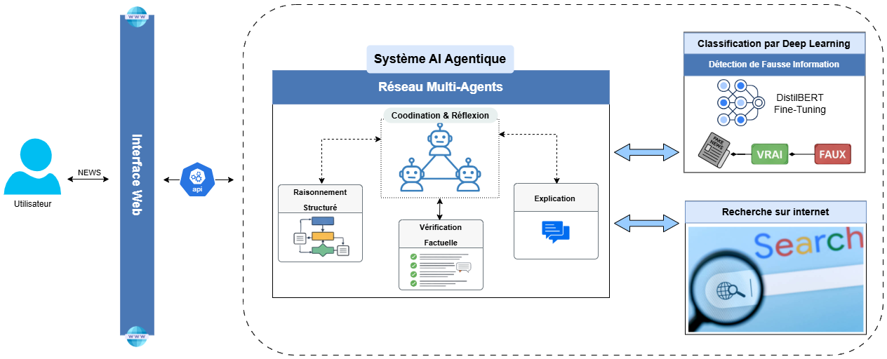
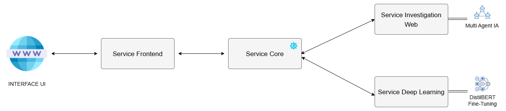
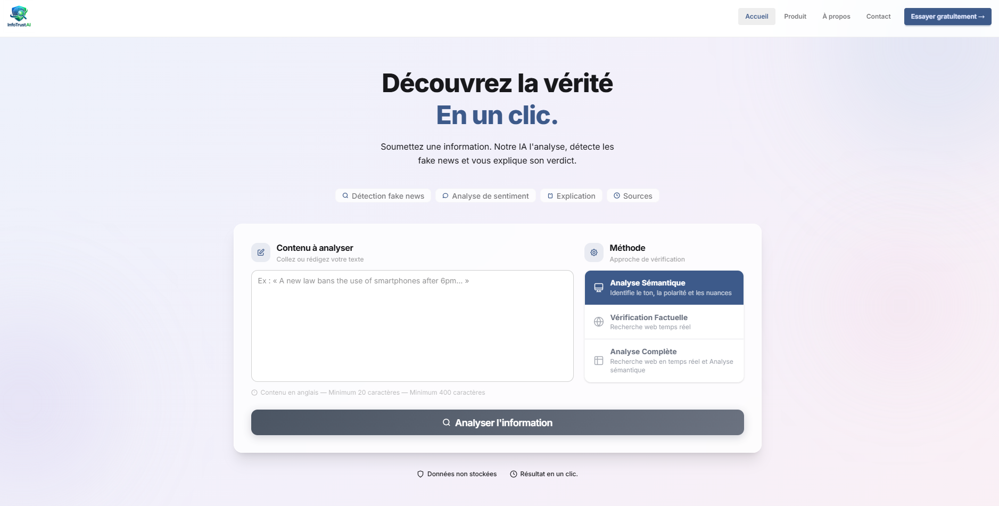

<p align="center">
  
</p>

<h1 align="center">InfoTrust AI</h1>
<p align="center"><strong>Système de détection de désinformation par intelligence artificielle</strong></p>

## Description
**InfoTrust AI** est une solution avancée de détection automatique de la désinformation (fake news).  
Le système repose sur une architecture hybride combinant :

- Une classification par Deep Learning pour l’analyse sémantique initiale
- Un moteur de raisonnement agentique pour la vérification factuelle en temps réel

Cette approche permet de produire un verdict de crédibilité fondé à la fois sur des probabilités statistiques et sur des preuves factuelles issues de sources fiables.

## Mode d'Analyse
Notre système offre une flexibilité totale à l'utilisateur final en gérant trois modes d'analyse distincts :
  
  - **Analyse Sémantique (Deep Learning)** : Une vérification basée sur les patterns de désinformation intégrés au modèle DistilBERT.
  - **Vérification Factuelle (Investigation Web)** : Une vérification factuelle approfondie via le web scraping et la confrontation de sources via un système multi agent IA autonome.
  - **Mode Hybride (Deep Learning + Investigation Web)** : Une fusion intelligente des deux sous-systèmes pour obtenir un verdict final à double facteur, garantissant le plus haut niveau de fiabilité de la plateforme.

## 📌 Architecture




## 📘 Guide d'installation

### 1. Vérification des prérequis 

Exécutez les commandes suivantes pour vérifier que Docker et Docker Compose sont correctement installés :

```bash
# Vérification de la version de Docker
docker --version

# Vérification de la version de Docker Compose
docker compose version

# Validation du statut du service Docker
sudo systemctl status docker
```

### 2. Services Tierces & Clés API

L'application nécessite des accès API pour ses capacités de recherche et de raisonnement :

> **⚠️ Note importante**  
> Vous n'avez pas besoin de clés API si vous souhaitez utiliser le mode **analyse sémantique uniquement**. Elles sont nécessaires uniquement dans le mode **vérification factuelle** et **analyse complète**

| Service | Utilité | Lien |
| :--- | :--- | :--- |
| **Serper.dev** | Moteur de recherche pour la récupération de données en temps réel. | [serper.dev](https://serper.dev/) |
| **Google Gemini** | Modèle de langage principal pour l'analyse. | [Google AI Studio](https://aistudio.google.com/) |

> [!IMPORTANT]
> **Recommandation Gemini :** Il est fortement conseillé d'utiliser un **profil payant** pour l'API Gemini afin de lever les limitations strictes de quota des comptes gratuits (Rate Limiting). 

> *Astuce :* Les nouveaux utilisateurs peuvent bénéficier d'un [crédit de 300$ via Google Cloud](https://cloud.google.com/free).

### 3. Clonage du dépôt

Clonez le dépôt officiel du projet depuis GitLab pour récupérer l'ensemble du code source et des configurations Docker :

```bash
git clone https://gitlab.com/uqac1674503/infotrustai.git
```

### 4. Mise en place de N8N

**N8N** est une plateforme d’automatisation de workflows. Dans le cadre de la solution InfoTrust AI, elle est utilisée pour la mise en place et l’orchestration de nos différents systèmes d’IA agentique.

> **⚠️ Note importante**  
> Vous n'avez pas besoin de N8N si vous souhaitez utiliser le mode **analyse sémantique uniquement**. Il est nécessaires uniquement dans le mode **vérification factuelle** et **analyse complète**


[Mise en place de n8n](./modules/web_investigation/n8n/README.md)

### 5. Mise en place de InfoTrust AI

L'option la plus usuelle consiste à effectuer un déploiement via Docker Compose.

##### Architecture des services



#### Étape 1 : Configuration des variables d'environnement
Avant de lancer les conteneurs, il est recommandé d’utiliser un fichier .env situé à la racine du projet afin de centraliser et sécuriser les variables sensibles.

```bash
cp .env.dist .env
```

##### Variables à configurer

| Variable | Valeur                                                           | Remarque                                                                                                                    |
|----------|------------------------------------------------------------------|-----------------------------------------------------------------------------------------------------------------------------|
| `SECRET_KEY` | `votre_clé_secrète`                                              | Clé secrète utilisée pour sécuriser l’API                                                                                   |
| `GEMINI_API_KEY` | `votre_clé_gemini`                                               | Clé API pour accéder aux services Google Gemini                                                                             |
| `CORE_API_URL` | ex: `http://server_ip:8089`                                      | URL du service core (ne pas utiliser localhost ou 127.0.0.1 — utiliser une IP accessible depuis les autres conteneurs/clients) |
| `AI_AGENT_API_URL` | ex: `http://127.0.0.1_or_server_ip:5678/webhook/your_webhook_id` | Votre URL du webhook n8n                                                                                                    |

#### Étape 2 : Lancement des conteneurs

Une fois la configuration terminée, lancez l’ensemble des services avec Docker Compose :
```bash
docker-compose up -d
```

#### Étape 3 : Vérification des services

```bash
docker-compose ps
```

Vous devriez obtenir trois services avec le statut Up :

| Service                         | Statut attendu |
|---------------------------------|----------------|
| `infotrustai-deep_learning_api` | Up |
| `infotrustai-core_api`          | Up |
| `infotrustai-frontend`          | Up |


#### Étape 4 : Vérification de l’API Deep Learning

Une fois les services démarrés, vous pouvez tester le bon fonctionnement de l’API de Deep Learning en envoyant une requête de prédiction.

```bash
curl -X POST "http://127.0.0.1:8088/predict" -H "Content-Type: application/json" -d "{\"user_input\": \"NASA recently admitted in a leaked internal memo that the 1969 moon landing was filmed in a high-security studio in Nevada because the radiation belts were too deadly for astronauts to survive the journey through deep space.\"}"
```

## 🌐 Connexion à la plateforme

Une fois les conteneurs démarrés, vous pouvez accéder à la platforme via l'interface utilisateur principale avec  votre navigateur :

1. Ouvrez votre navigateur à l'adresse : `http://localhost_or_your_ip_address_:8000`

2. Vous devriez voir la page d'accueil d'InfoTrust AI




### ⏱️ Temps d'analyse

> 💡 **Note** L'analyse via la méthode de vérification factuelle et l'analyse complète prend du temps **(~7 minutes)** en fonction de la complexité du contenu à analyser.
